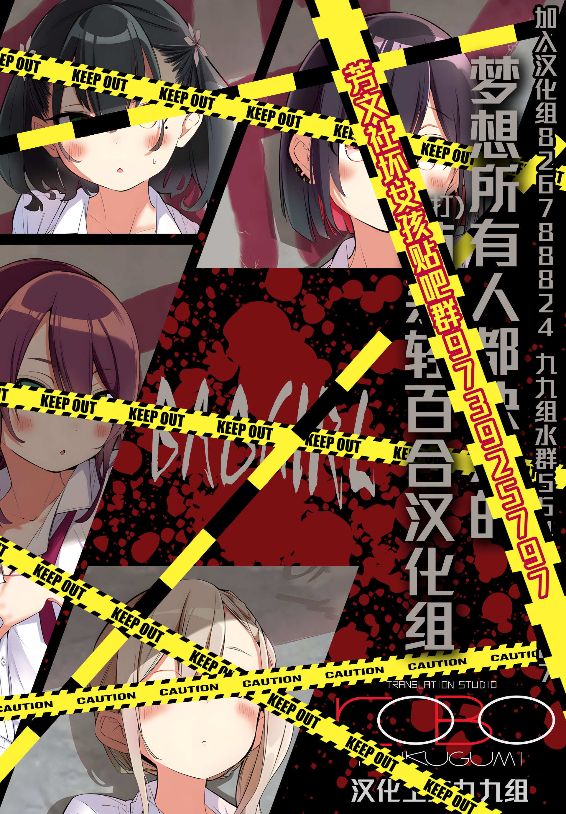

# 前因后果

## 看前必知

我认为学习是需要一个从简到难的过程，所以该指南会囊括 **基础栏、入门栏、进阶栏** 供大家按需学习

我会总结一些大家经常错的问题放进常见问题档中，大家看到尽量的避免这些问题

当然我撰写的指南也不一定是全对的，有问题错误也欢迎找我进行纠正

在我精力时间允许的情况下，我会保持指南的持续的更新。

**最后我想说**

**办法不一定需要按我的来，只要能把效果展示的很好，无论什么办法都是很好的办法！**

## Why？

写该指南是为了帮助更多想要为芳文社作品的宣传做贡献的伙伴们。

不管电脑屏幕前的你有没有嵌字的基础，只要愿意和我一起共同进步发展，我相信只要学完后指南后你在处理嵌字相关的问题会更加游刃有余。

希望我撰写的指南可以成为大家进军嵌字的一个有利的工具。

## 宣传

<figure><figcaption>
Bad Girl贴吧群宣传图
</figcaption></figure>

<figure><figcaption>
九九组宣传图
</figcaption></figure>

