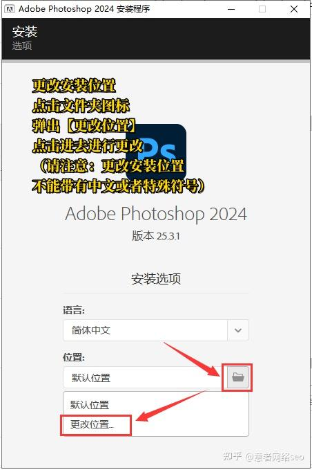

# 安装PhotoShop


如果说你的电脑中已经安装PhotoShop，那你可以考虑跳过这章节！


在这之前，我仅仅在这推荐大家安装以下几个版本的PS

* PhotoShop 2018 (推荐，大部分老机型4G运行内存的笔记本电脑应该还可以用)
* PhotoShop 2020 (配置比较充裕考虑这个，**神中神**)
* PhotoShop 2024 (主流的笔记本最少8G运行内存都没问题，使用的话可能少部分字体会出现兼容问题)

### 下载

百度网盘: [https://pan.baidu.com/s/1bZf3iV0xRo9tUh6-XdSGMg?pwd=i8ii](https://pan.baidu.com/s/1bZf3iV0xRo9tUh6-XdSGMg?pwd=i8ii)

提取码:[i8ii](https://pan.baidu.com/s/1bZf3iV0xRo9tUh6-XdSGMg?pwd=i8ii)

<figure><figcaption>
找好路径，别下错噢
</figcaption></figure>

### 安装

#### 解压安装包

右键下载压缩包，选择“解压到当前文件夹”（**若系统为Win11需先点击“显示更多选项”**）。

若解压失败，建议使用其他压缩软件，比如**7-Zip**工具

#### 运行安装程序

进入解压后的文件夹，右键 `Set-up.exe` 选择“**以管理员身份运行**”。

安装前需**关闭杀毒软件和防火墙**，来避免造成冲突。

#### 自定义安装路径

点击安装界面中的**文件夹图标**，选择**非系统盘（如D盘）**，新建 `PS2024`  文件夹并确认路径。

该举可避免因为C盘的存储空间不足而导致的性能问题。

<figure><figcaption>
引用:知乎@<a href="https://www.zhihu.com/people/zhi-chi-tian-ya-65-87-35">意者网络seo</a>
</figcaption></figure>

#### 安装完成

点击**继续**后，等待安装的进度条完成（约5-15分钟，视电脑配置而定），最后点击**关闭**。

### 创建快捷方式

打开开始菜单，在**全部应用**中找到 `Adobe Photoshop 2024`，拖拽图标至桌面即可。

<figure><figcaption>
图标如上
</figcaption></figure>

鼠标双击  `Adobe Photoshop 2024` 快捷方式即可打开PS，开始你的下一步!

### 安装常见问题 

#### **安装失败提示**

* 原因：磁盘空间不足、网络中断或软件冲突。
* 解决：确保安装盘剩余空间＞10GB；关闭后台程序（如浏览器、下载工具）；使用有线网络替代WiFi

#### 启动后提示“组件缺失”

* 原因：旧版本残留文件冲突。
* 解决：彻底卸载旧版PS，删除`/Library/Application Support/Adobe/caps`文件夹

